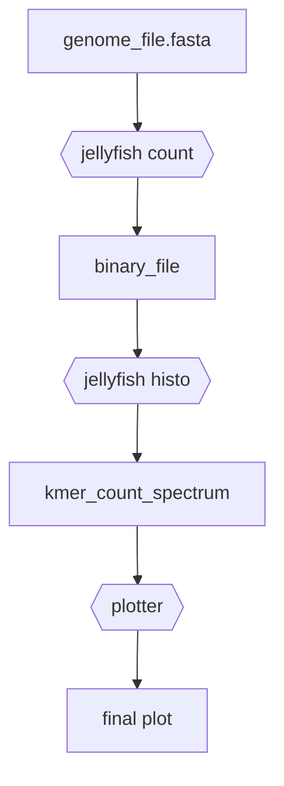

# snakemake tutorial
A short tutorial on snakemake.

## Disclaimer
After this tutorial, you will

- :white_check_mark: have a basic working knowledge on snakemake
- :x: not have an in-depth knowledge


## Why snakemake

- Uses `gnu make` concept
- Combines and supports pieces of python code
- Enables putting together a pipeline easily
- Supports parallel execution of jobs
- Records time and memory uses

## Installation

Using conda.
```
conda install snakemake
```

### Tools used in this tutorial

```
conda install -c bioconda jellyfish
conda install matplotlib
conda install pandas
conda install numpy
```

## A simple pipeline
`Jellyfish` is a kmer counting tool. Let us use the following pipeline:



Converting this to a shell workflow, we may have something like the following (also written in `pipeline.sh`):

```
jellyfish count -m 15 -s 500M data/ecoli_ed1a.fasta -o data/mer_counts_ecoli_ed1a.jf
jellyfish histo data/mer_counts_ecoli_ed1a.jf -o data/kmer_count_histogram_ecoli_ed1a
python plotter.py data/kmer_count_histogram_ecoli_ed1a results/kspectrum_plot_ecoli_ed1a.pdf
```

### Problems in using shell (or python)
- Change something in the plotting script: re-run everything (or change the pipeline code)
- Run for different input files: need to run sequentially (after adding command line args)
- Need to write extra code to measure running time
- Difficult to measure memory usage

Using snakemake, these problems can be solved.

## Writing the pipeline in snakemake

### The snakefile

To use snakemake, we need to create a file named `snakefile`.

### Rules in snakefile

The snakefile consists of some rules. These rules typically execute stages of the pipeline. In our case, we will write a rule for each of the commands `jellyfish count`, `jellyfish histo` and `python plotter`.

A rule has a few code blocks. Usually, the following blocks are commonly seen:

- input
- output
- shell (or run)

An example rule is as follows:

```
rule jf_count:
    input:
        "data/ecoli_ed1a.fasta"
    output:
        "data/mer_counts_ecoli_ed1a.jf"
    shell:
        "jellyfish count -m 15 -s 500M data/ecoli_ed1a.fasta -o data/mer_counts_ecoli_ed1a.jf"
```

This rule basically transcribes to the following: we need this input, and will generate this output, using this shell command. The name of the rule can be anything: it does not matter as long as it is a valid python variable name.

This rule above corresponds to the first line in our pipeline. Let us write the other two rules:

```
rule jf_histo:
    input:
        "data/mer_counts_ecoli_ed1a.jf"
    output:
        "data/kmer_count_histogram_ecoli_ed1a"
    shell:
        "jellyfish histo data/mer_counts_ecoli_ed1a.jf -o data/kmer_count_histogram_ecoli_ed1a"

rule plot:
    input:
        "data/kmer_count_histogram_ecoli_ed1a",
        "plotter.py"
    output:
        "results/kspectrum_plot_ecoli_ed1a.pdf"
    shell:
        "python plotter.py data/kmer_count_histogram_ecoli_ed1a results/kspectrum_plot_ecoli_ed1a.pdf"
```

### Rule all

Let us now talk a little about how snakemake works. Snakemake does NOT run all rules one after the other. If that were the case, there would not be any difference between the shell pipeline and the snakemake version of the pipeline. Snakemake will actually use a special rule, which is called 'rule all' -- and only execute the rules that help us achieve the effects of 'rule all'.

In our case, the following could be a rule all.

```
rule all:
    input:
        "results/kspectrum_plot_ecoli_ed1a.pdf"
```

It is standard practice to write all desired target files as the input of the rule all. The output and shell blocks are usually left empty. Snakemake will then scan through all target files, and if any of them is missing, snakemake will try to locate a rule that generates the missing target file. This can go on recursively. If no rule is found that can generate a target file desired by rule all, error will be reported.

### Running the pipeline using snakemake

These instructions are written in `snakefile_v1`. Command to run this is:

`snakemake --snakefile snakefile_v1`

### Other ways to use input/output file list

If there is a file list, then it can be indexed. Therefore, instead of writing the filenames in the shell block, we can use 'input[0]' or '[output[0]'. See `snakefile_v2` for a simple example. This is the same as `snakefile_v1`, except uses these indexed notations.

Another thing to note is that these are all just python strings. So, usual string manipulation works.


## Parallel execution
### Wildcards and expand
### Write the 'shell' block

## Benchmarking using snakemake
