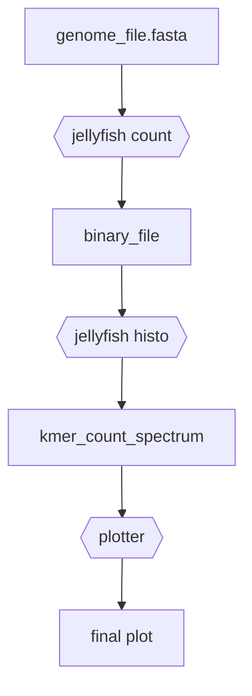

# snakemake tutorial
A short tutorial on snakemake.

## Disclaimer
After this tutorial, you will

- :white_check_mark: have a basic working knowledge on snakemake
- :x: not have an in-depth knowledge


## Why snakemake

- Uses `gnu make` concept
- Combines and supports pieces of python code
- Enables putting together a pipeline easily
- Supports parallel execution of jobs
- Records time and memory uses

## Installation

Using conda.
```
conda install snakemake
```

### Tools used in this tutorial

```
conda install -c bioconda jellyfish
conda install matplotlib
conda install pandas
conda install numpy
```

## A simple pipeline
`Jellyfish` is a kmer counting tool. Let us use the following pipeline:



Converting this to a shell workflow, we may have something like the following (also written in `pipeline.sh`):

```
jellyfish count -m 15 -s 500M data/ecoli_ed1a.fasta -o data/mer_counts_ecoli_ed1a.jf
jellyfish histo data/mer_counts_ecoli_ed1a.jf -o data/kmer_count_histogram_ecoli_ed1a
python plotter.py data/kmer_count_histogram_ecoli_ed1a results/kspectrum_plot_ecoli_ed1a.pdf
```

### Problems in using shell (or python)
- Change something in the plotting script: re-run everything (or change the pipeline code)
- Run for different input files: need to run sequentially (after adding command line args)
- Need to write extra code to measure running time
- Difficult to measure memory usage

## Writing the pipeline in snakemake

### The snakefile
### Rules in snakefile
### Running the pipeline using snakemake
### Other ways to use input list
### Other ways to run

## Parallel execution
### Wildcards and expand
### Write the 'shell' block

## Benchmarking using snakemake
