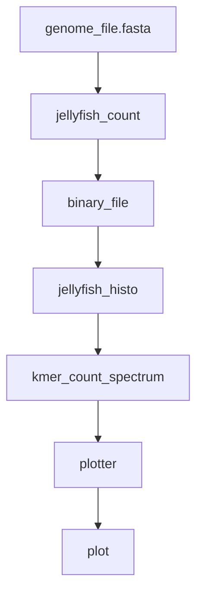

# snakemake tutorial
A short tutorial on snakemake.

## Disclaimer
After this tutorial, you will

- :white_check_mark: have a basic working knowledge on snakemake
- :x: not have an in-depth knowledge


## Why snakemake

- Uses `gnu make` concept
- Combines and supports pieces of python code
- Enables putting together a pipeline easily
- Supports parallel execution of jobs
- Records time and memory uses

## Installation

Using conda.
```
conda install snakemake
```

### Tools used in this tutorial

```
conda install -c bioconda jellyfish
```

## A simple pipeline
`Jellyfish` is a kmer counting tool. Let us use the following pipeline:



## Writing the pipeline in snakemake

### The snakefile
### Rules in snakefile
### Running the pipeline using snakemake
### Other ways to use input list
### Other ways to run

## Parallel execution
### Wildcards and expand
### Write the 'shell' block

## Benchmarking using snakemake
